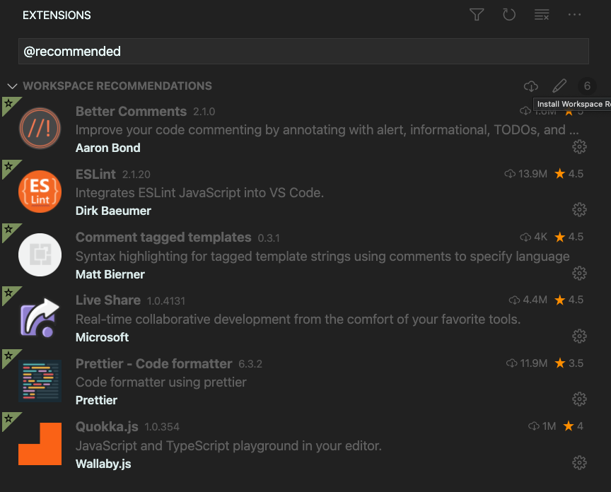
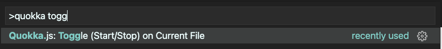
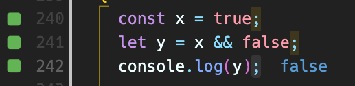

# Frontend Onboarding

Welcome to my frontend onboarding repo! This is a WIP repo for learning
TypeScript and React. Currently the material is presented as comments and
code with help from a few extensions to improve the experience.

I recommend installing all of the recommended extensions to get the full experience:

## [TypeScript Overview](./src/typescript-overview.ts)

Read through the `src/typescript-overview.ts` file to
get a basic understanding of how TypeScript and JavaScript works. This is
written for someone who has never written JavaScript before, but should be
familiar with other programming languages.

### Quokka Setup

[Quokka](https://quokkajs.com/docs/index.html) is a VSCode extension that
turns your editor into a coding playground. It allows you to evaluate
expressions within the editor and play around with TypeScript syntax.

To enable it for the material:

1. Open `src/typescript-overview.ts` in VSCode
2. Open command prompt using `Ctrl + Shift + P` or `Command + Shift + P`
3. Run `Quokka.js Toggle`

Code should now run within your editor:

## React Overview

Coming Soon!
